# CITELY.AI
---

Citely.ai is SASS platform that aims to help researchers and students to manage the plethora of information they come across during their research by leveraging the power of Large Language Models like ChatGPT. The main focus of citely.ai is to provide a fast and efficient way to understand, organize and discover new scientific knowledge.

This platform was developed after being accepted as a startup project for the [EGG Incubator](https://www.theegg.gr/en/) program of EuroBank in Greece. The project was developed by a team of 2 people, with me being the lead developer and responsible for the design, frontend and backend development of the platform while the other member was responsible for the NLP part of the project. While this project did not get to the final stage of the program, it was a great learning experience for me and I got to work with some amazing people.

The following is an overview of the platform and its tech stack to provide a better understanding of the features that were implemented and the technologies that were used.

## Tech Stack

* Vue3 / TailwindCSS / Vite (for the Web App interface)
* Supabase for the database, storage and user authentication
* Python / FastAPI / LangChain / Vector Database (for the NLP part of the platform)
* APIs used: OpenAI ChatGPT/Embeddings, Semantic Scholar, Stripe (for payment processing)

## Features

* **User Authentication**: Users can sign up and login to the platform using their email and password. The platform also supports social login using Google and Github.
* **Workspace**: Users can see their recent activity, saved articles, and other relevant information on their dashboard.
* **Article Search**: Users can search for articles using the Semantic Scholar API and save them to their workspace.
* **Chat Interface**: Users can interact with the LLM model using the ChatGPT-like interface to ask questions and get answers based on the articles they have saved.
* **Payment Processing**: Users can subscribe to a monthly plan to access premium features of the platform using the Stripe API.

The basic idea behind the platform is to provide a an all in one solution for researchers to query all the academic articles they have saved in their workspace and get answers to their questions in a conversational manner. In the background the platform transforms the PDF into LaTex, uses the LangChain API to generate embeddings for the articles and the ChatGPT API to generate answers to the user's questions. With the power the LLM Agents architecture, we can provide a more conversational and human-like experience to researchers and students.

## The Platform

### Login Page

The login page is the first page users see when they visit the Web App. Users can sign up or login using their email and password. The platform also supports social login using Google and Github.

<!-- image -->
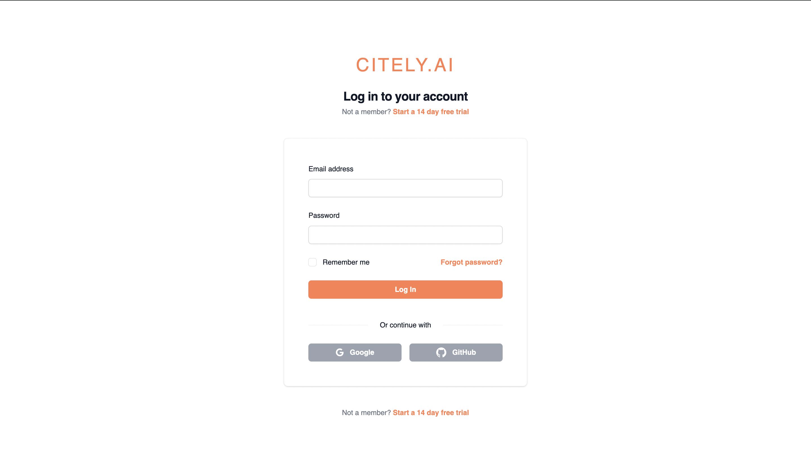

### Main Page

The main page is where users can manage and create Workspaces where in they can save articles, search for new articles, and interact with the Chat Interface.

---
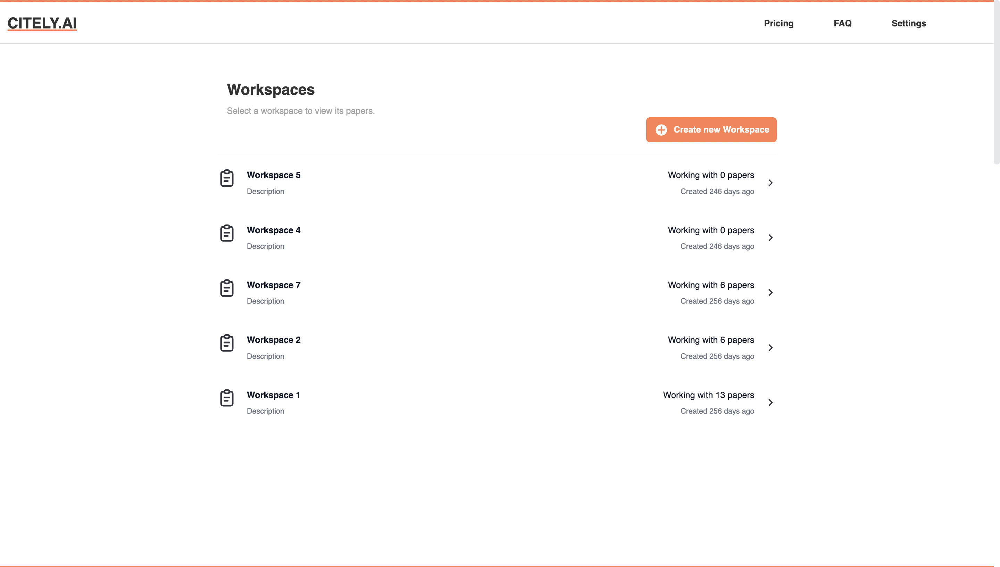

---

### Workspace

The Workspace is where users can see their recent activity, saved articles, and other relevant information on their dashboard.

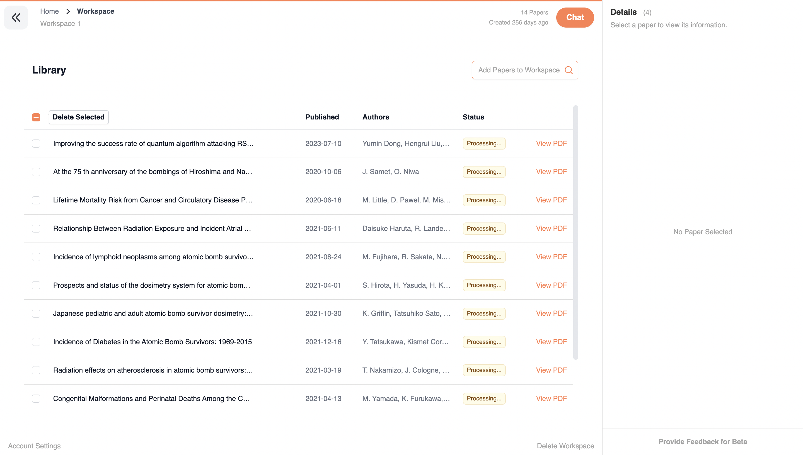

---

### Article Search

Users can search for articles using the Semantic Scholar API and save them to their workspace in one click.

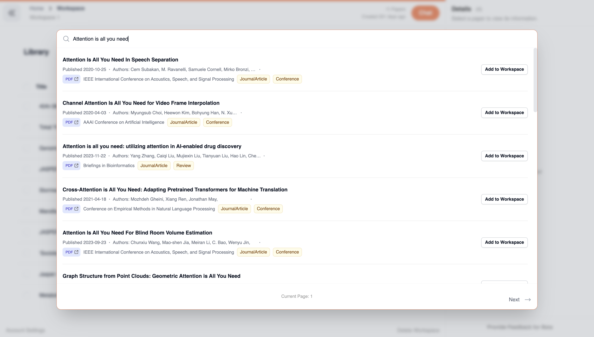

---

### PDF Viewer

Users can view the PDF of the articles they have saved in their workspace. They can also explore relevant papers through the references column on the right.

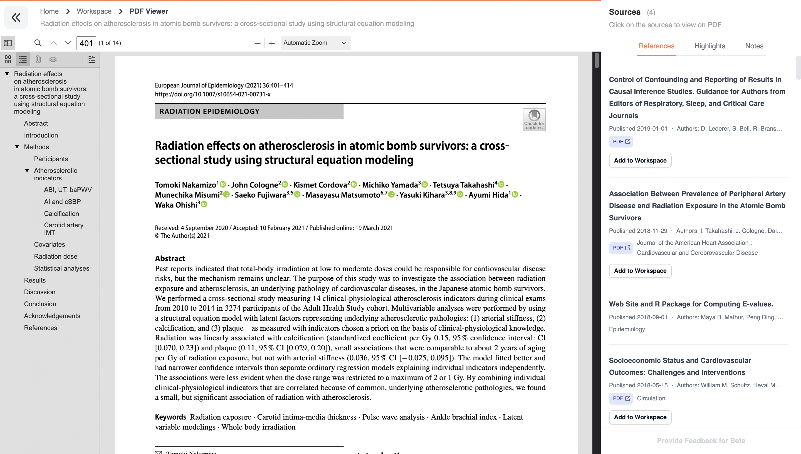

---

### Chat Interface

This is the most important feature of the platform. Users can interact with their imported articles using the ChatGPT-like interface to ask questions and get answers based on the articles they have saved.

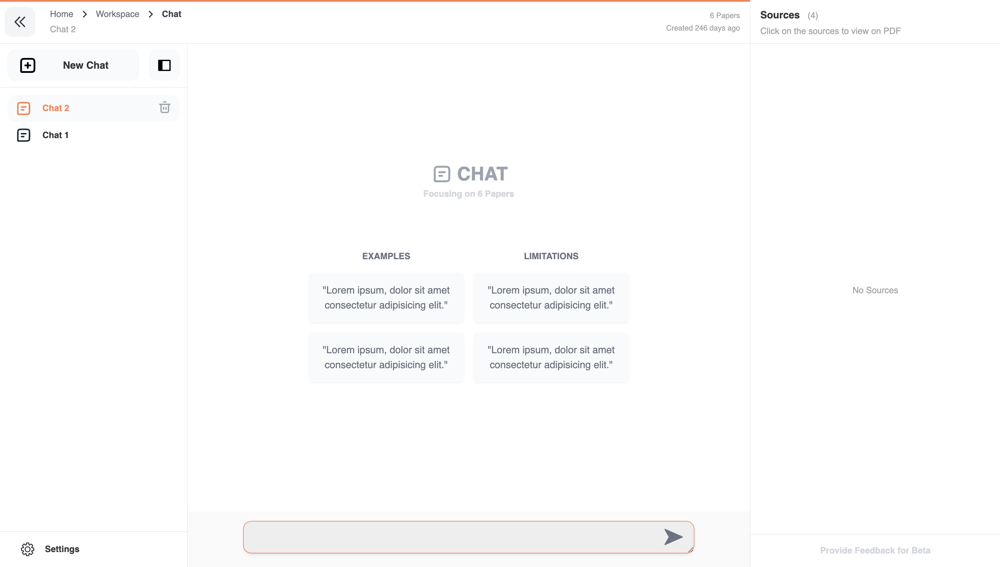

---

The chat interface supports live rendering of LaTex, Chemical Equations, and other scientific notations. This was the most interesting part of the project as it required a lot of work to get the rendering right and support Adaptable UI functionalities extending the ChatGPT interface

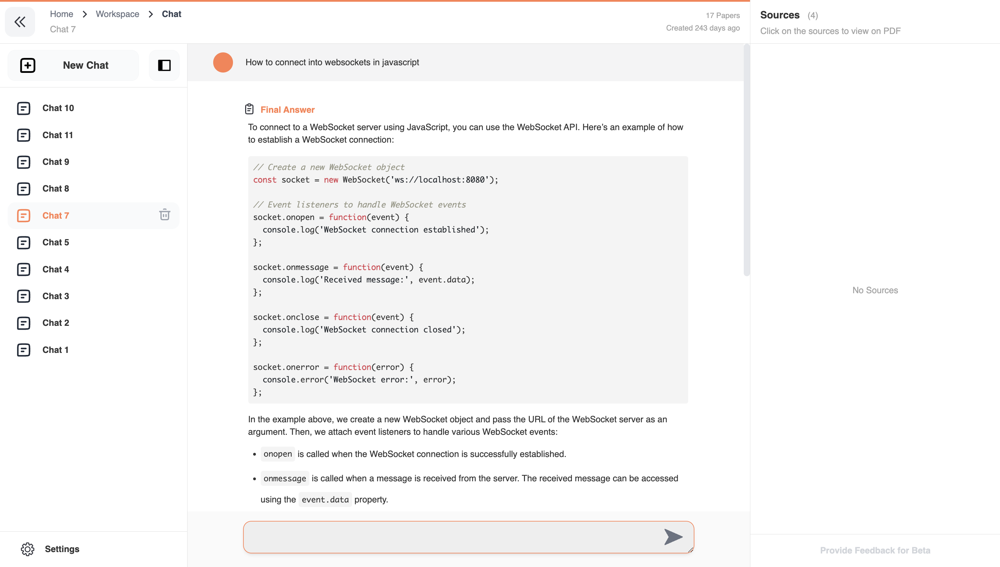

---

The platform supports rendering of Chemical Equations.

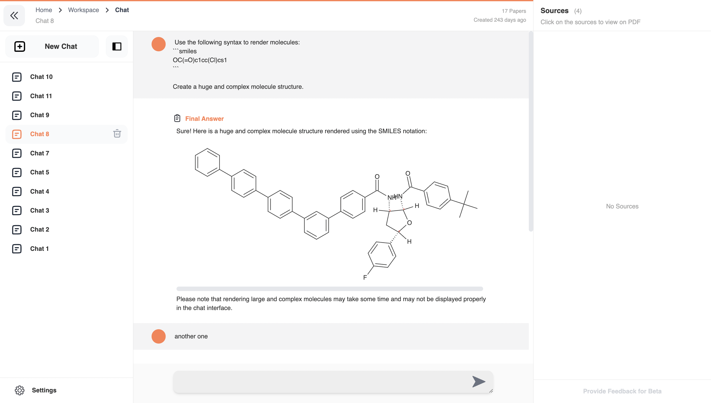

---

The platform also supports rendering of LaTex equations.

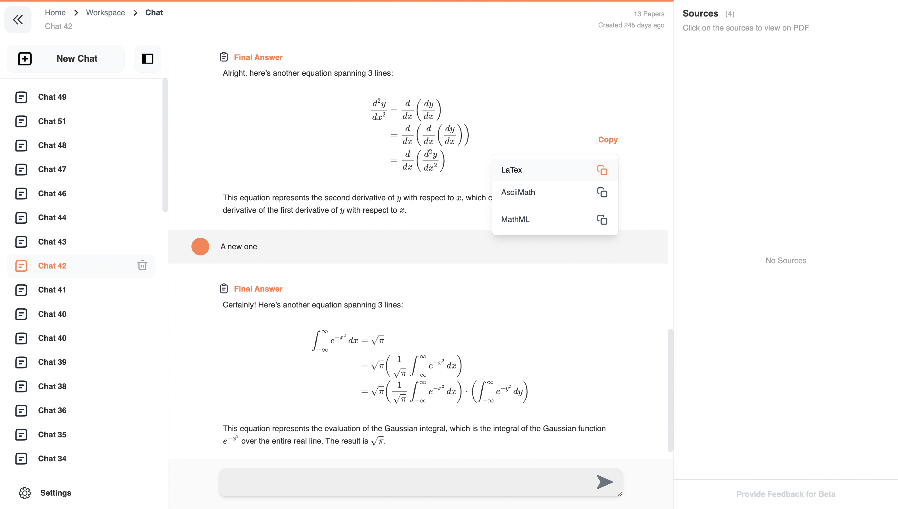

### Settings

Users can manage their account settings, subscription plans, and other relevant information in the settings page.

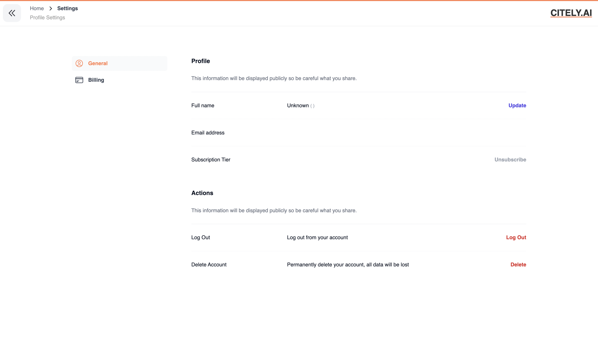

---

### Payment Processing

Users can subscribe to a monthly plan to access premium features of the platform using the Stripe API.

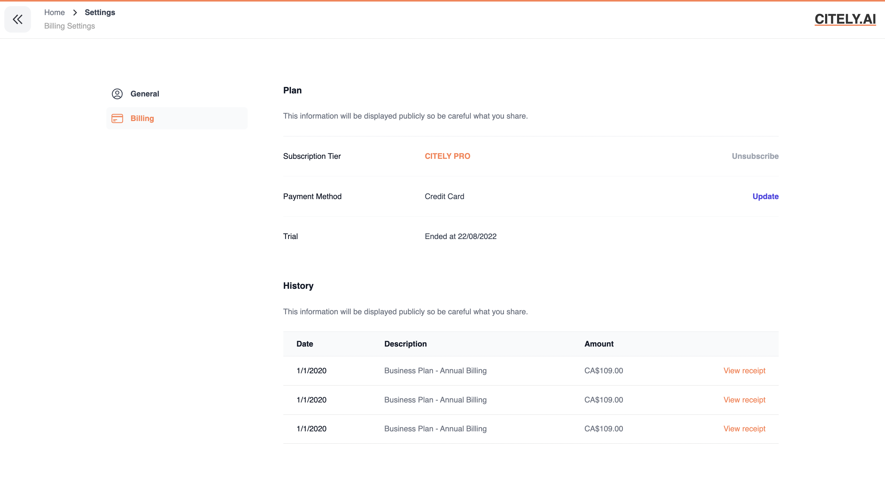

## Conclusion

Citely.ai was a great project to work on and I learned a lot about the power of Large Language Models and their limitations. By designing and building the platform from scratch I gained a lot of experience in building full-stack applications and integrating different APIs.

The javascript engineering aspect of the project like the chat interface and the integrated PDF viewer were the most challenging and interesting parts of the project. I had to learn a lot about the different libraries and tools available to build these features and it was a great learning experience.

The platform is still in development and there are many features that can be added to make it more useful for researchers and students.